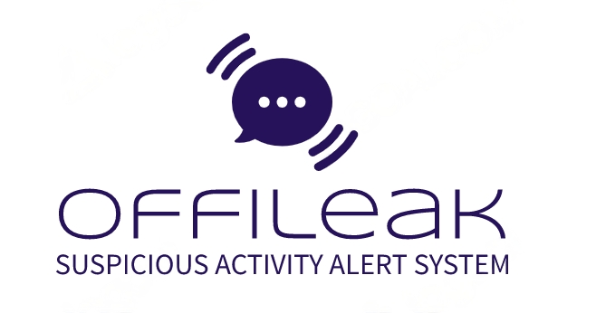
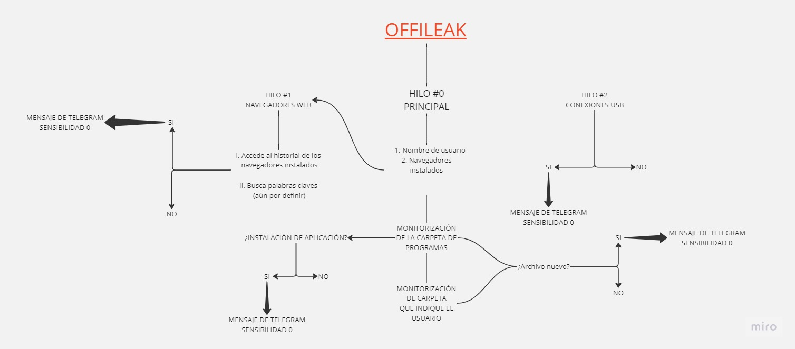

# OFFILEAK

## Licencia
Este proyecto está licenciado bajo la licencia [MIT](LICENSE).

## Tabla de funciones
| Función                    | Estado      |
| -------------------------- | ----------- |
| Verifica instalación y uso de los navegadores Mozilla y Chrome        | Completada  |
| Busca palabras claves en el historial de Mozilla (places.sql) en cada perfil y en History de Chrome         | Completada  |
| Creador de consulta SQl con todas las palabras claves que se guardan en una lista      | Completada  |
| Monitorización de carpetas      | Completada  |
| Envio de mensajes por Telegram      | Completada  |
| Detección de conexiones USB      |  Pendiente  |
| Frontend web      | Pendiente  |

## Diagrama de hilos

## ¿Cómo funciona?
Próximamente

## Sobre el autor
- Name: Jorge Coronado (AKA Jorge Websec)
- Twitter: @JorgeWebsec
- LinkedIn (https://www.linkedin.com/in/jorge-coronado-quantika14/)

## ¿Cómo ayudar?
Puedes ayudar de muchas formas. Te expongo algunas ideas:
1. Haz un fork con tus mejoras, enseñamelas y hacemos un merge
2. No hace falta que sepas programar puedes proponerme ideas. Contacta conmigo por mis redes sociales o aquí
3. Arregla bugs
4. Ayudame en la parte de Frontend es la que peor se me da
